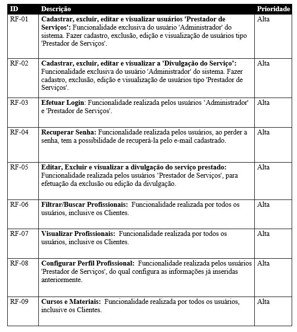
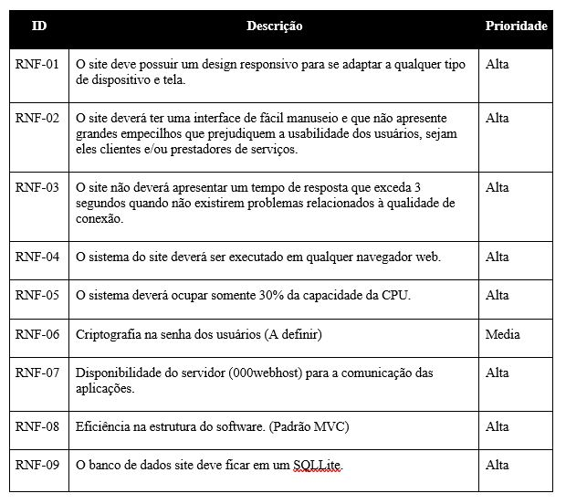
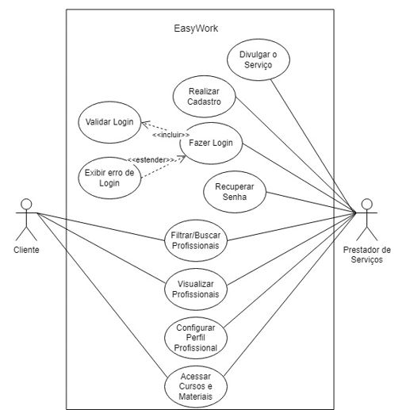

# Especificações do Projeto

Pré-requisitos: <a href="1-Documentação de Contexto.md"> Documentação de Contexto</a>

Consolidou-se a definição do problema e os pontos mais relevantes a serem tratados neste projeto por meio da participação dos usuários. Com isso, foi possível realizar a imersão pelos membros da equipe a partir da observação dos usuários e por meio de entrevistas. Temos a seguir os detalhes das personas e histórias de usuários levantados nesse estudo. 

## Personas

As personas levantadas durante o processo de entendimento do problema são apresentadas a seguir:

## Histórias de Usuários

Com base na análise das personas foram identificadas as seguintes histórias de usuários:

## Requisitos

As tabelas que se seguem apresentam os requisitos funcionais e não funcionais que detalham o escopo do projeto.

### Requisitos Funcionais

### Requisitos não Funcionais

## Restrições

O projeto está restrito pelos itens apresentados na tabela a seguir.

## Diagrama de Casos de Uso

1 - Identificar Atores:
•	Cliente pode ser pessoa Física ou Jurídica;
•	Profissionais da Construção Civil.

2 – Identificar Casos de Uso:

Para Clientes pessoa Física ou Jurídica:
•	Por meio da ferramenta do site é possível Filtrar e Buscar os profissionais das regiões da grande São Paulo;

•	Podem acessar os cursos e materiais indicados pela plataforma;

•	Visualizar todos os profissionais prestadores de serviço.

Para Profissionais da Construção Civil:
•	Deverá realizar o cadastro para ter acesso ao login e as funcionalidades da página;

•	Para o Cadastro é necessário acrescentar todas as informações para uma melhor divulgação do trabalho do profissional;

•	Com isso feito, é possível fazer o login da página e caso esqueça a senha é direcionado a uma página para recuperação;

•	Então o profissional terá acesso à página para editar as informações inseridas no cadastro para melhor Divulgar o Serviço;

•	Em seguida, por meio da ferramenta do site é possível Filtrar e Buscar os profissionais das regiões da grande São Paulo;

•	Podem acessar os cursos e materiais indicados pela plataforma;

•	Além da informação própria do profissional é possível visualizar todos os profissionais prestadores de serviço.

