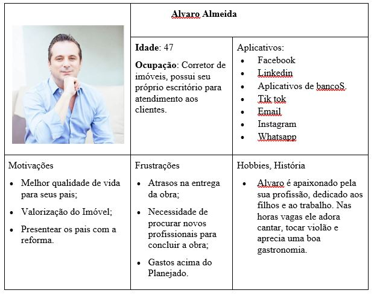
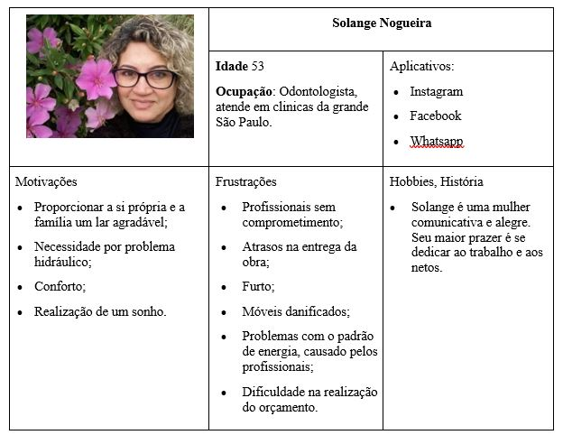

# Especificações do Projeto

Pré-requisitos: <a href="1-Documentação de Contexto.md"> Documentação de Contexto</a>

Consolidou-se a definição do problema e os pontos mais relevantes a serem tratados neste projeto por meio da participação dos usuários. Com isso, foi possível realizar a imersão pelos membros da equipe a partir da observação dos usuários e por meio de entrevistas. Temos a seguir os detalhes das personas e histórias de usuários levantados nesse estudo. 

## Personas

As personas levantadas durante o processo de entendimento do problema são apresentadas a seguir:

## Histórias de Usuários

Com base na análise das personas foram identificadas as seguintes histórias de usuários:

https://github.com/ICEI-PUC-Minas-PMV-ADS/pmv-ads-2022-2-e2-proj-int-t6-easywork/blob/main/docs/img/historiadeusuario.PNG

> **Links Úteis**:
> - [Histórias de usuários com exemplos e template](https://www.atlassian.com/br/agile/project-management/user-stories)
> - [Como escrever boas histórias de usuário (User Stories)](https://medium.com/vertice/como-escrever-boas-users-stories-hist%C3%B3rias-de-usu%C3%A1rios-b29c75043fac)
> - [User Stories: requisitos que humanos entendem](https://www.luiztools.com.br/post/user-stories-descricao-de-requisitos-que-humanos-entendem/)
> - [Histórias de Usuários: mais exemplos](https://www.reqview.com/doc/user-stories-example.html)
> - [9 Common User Story Mistakes](https://airfocus.com/blog/user-story-mistakes/)

## Requisitos

As tabelas que se seguem apresentam os requisitos funcionais e não funcionais que detalham o escopo do projeto.

### Requisitos Funcionais

https://github.com/ICEI-PUC-Minas-PMV-ADS/pmv-ads-2022-2-e2-proj-int-t6-easywork/blob/main/docs/img/reqfuncionais.PNG

### Requisitos não Funcionais

https://github.com/ICEI-PUC-Minas-PMV-ADS/pmv-ads-2022-2-e2-proj-int-t6-easywork/blob/main/docs/img/reqnaofuncionais.PNG

Com base nas Histórias de Usuário, enumere os requisitos da sua solução. Classifique esses requisitos em dois grupos:

- [Requisitos Funcionais
 (RF)](https://pt.wikipedia.org/wiki/Requisito_funcional):
 correspondem a uma funcionalidade que deve estar presente na
  plataforma (ex: cadastro de usuário).
- [Requisitos Não Funcionais
  (RNF)](https://pt.wikipedia.org/wiki/Requisito_n%C3%A3o_funcional):
  correspondem a uma característica técnica, seja de usabilidade,
  desempenho, confiabilidade, segurança ou outro (ex: suporte a
  dispositivos iOS e Android).
Lembre-se que cada requisito deve corresponder à uma e somente uma
característica alvo da sua solução. Além disso, certifique-se de que
todos os aspectos capturados nas Histórias de Usuário foram cobertos.

## Restrições

O projeto está restrito pelos itens apresentados na tabela a seguir.

https://github.com/ICEI-PUC-Minas-PMV-ADS/pmv-ads-2022-2-e2-proj-int-t6-easywork/blob/main/docs/img/restricao.PNG

> **Links Úteis**:
> - [O que são Requisitos Funcionais e Requisitos Não Funcionais?](https://codificar.com.br/requisitos-funcionais-nao-funcionais/)
> - [O que são requisitos funcionais e requisitos não funcionais?](https://analisederequisitos.com.br/requisitos-funcionais-e-requisitos-nao-funcionais-o-que-sao/)

## Diagrama de Casos de Uso

1 - Identificar Atores:
Cliente pode ser pessoa Física ou Jurídica;
Profissionais da Construção Civil.

2 – Identificar Casos de Uso:
Fazer Login da página;
Cliente poder acessar os profissionais da const. Civil cadastrados na plataforma;
Possível filtrar a localidade dos profissionais, assim como ver o que o profissional é especializado;
O profissional da Const. Civil consegue se divulgar e acessar páginas com conhecimento da área. 

https://github.com/ICEI-PUC-Minas-PMV-ADS/pmv-ads-2022-2-e2-proj-int-t6-easywork/blob/main/docs/img/sistemaeasy.PNG

> **Links Úteis**:
> - [Criando Casos de Uso](https://www.ibm.com/docs/pt-br/elm/6.0?topic=requirements-creating-use-cases)
> - [Como Criar Diagrama de Caso de Uso: Tutorial Passo a Passo](https://gitmind.com/pt/fazer-diagrama-de-caso-uso.html/)
> - [Lucidchart](https://www.lucidchart.com/)
> - [Astah](https://astah.net/)
> - [Diagrams](https://app.diagrams.net/)
