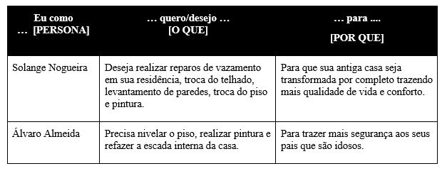
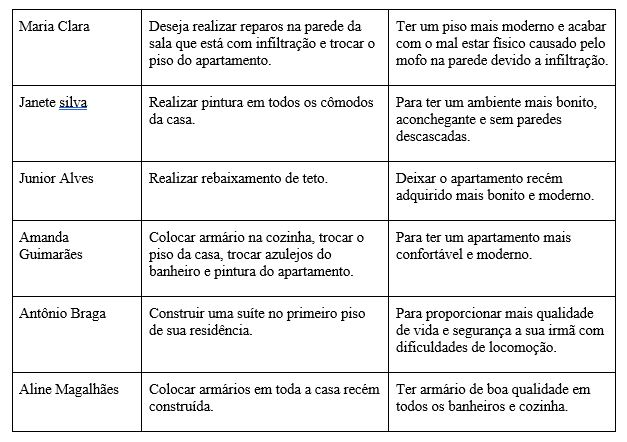
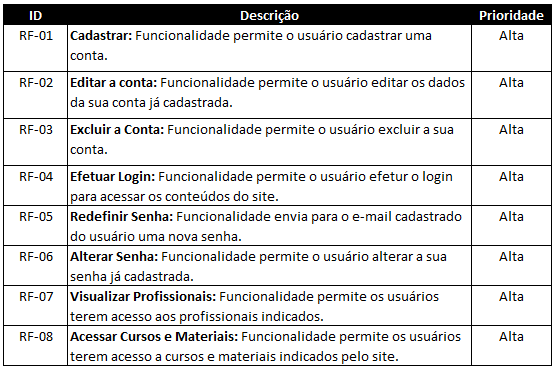
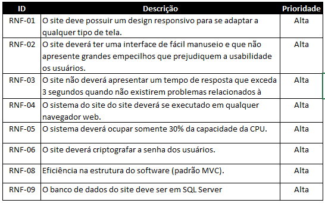
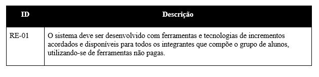
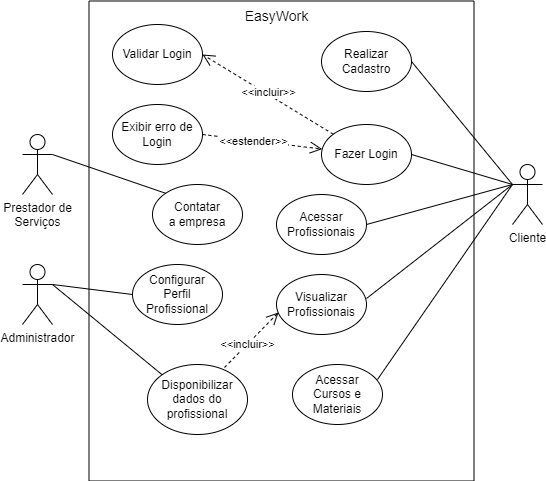

# Especificações do Projeto

Pré-requisitos: <a href="1-Documentação de Contexto.md"> Documentação de Contexto</a>

Consolidou-se a definição do problema e os pontos mais relevantes a serem tratados neste projeto por meio da participação dos usuários. Com isso, foi possível realizar a imersão pelos membros da equipe a partir da observação dos usuários e por meio de entrevistas. Temos a seguir os detalhes das personas e histórias de usuários levantados nesse estudo. 

## Personas

As personas levantadas durante o processo de entendimento do problema são apresentadas a seguir:

## Histórias de Usuários

Com base na análise das personas foram identificadas as seguintes histórias de usuários:

## Requisitos

As tabelas que se seguem apresentam os requisitos funcionais e não funcionais que detalham o escopo do projeto.

### Requisitos Funcionais

### Requisitos não Funcionais

## Restrições

O projeto está restrito pelos itens apresentados na tabela a seguir.

## Diagrama de Casos de Uso

1 - Identificar Atores:
 

•	Cliente pode ser pessoa Física ou Jurídica;

•	Profissionais da Construção Civil.

• Administrador do Sistema;

 

2 – Identificar Casos de Uso:
 

Para Clientes pessoa Física ou Jurídica:
 

•	Deverá realizar o cadastro;

• É necessário login para ter acesso as funcionalidades da página;

•	No site é possível visualizar todos os profissionais e prestadores de serviço das regiões da grande São Paulo;

•	Por meio das informações na página de Profissionais, os usuários podem entrar em contato com os prestadores de serviços.

•	Os usuários podem acessar os cursos e materiais indicados pela plataforma;

 

Para Profissionais da Construção Civil:
 

•	Os profissionais devem fornecer todas as suas informações por meio do contato no site;

•	A proposta do prestador passa por uma verificação, e após conclusão os seus dados são inseridos no sistema, ficando visível para todos usuários;

