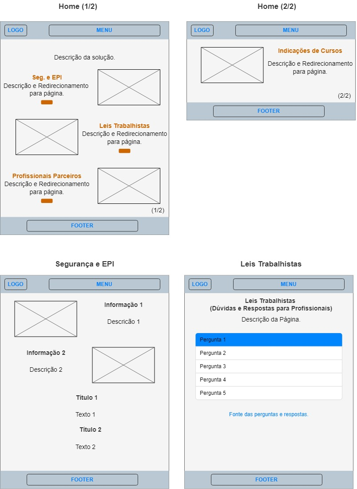

# Projeto de Interface

Visão geral da interação do usuário pelas telas do sistema e protótipo interativo das telas com as funcionalidades que fazem parte do sistema (wireframes).

## Diagrama de Fluxo

O diagrama apresenta o estudo do fluxo de interação do usuário com o sistema interativo. Para o esquema de nosso projeto temos separado o fluxo pelas principais páginas do qual mostra a interação do usuário, sendo elas:
- Segurança e EPI
- Leis Trabalhistas
- Profissionais
- Cursos e Materiais 
- Entrar

## Wireframes

Para os Wireframes da solução, temos a seguir:

